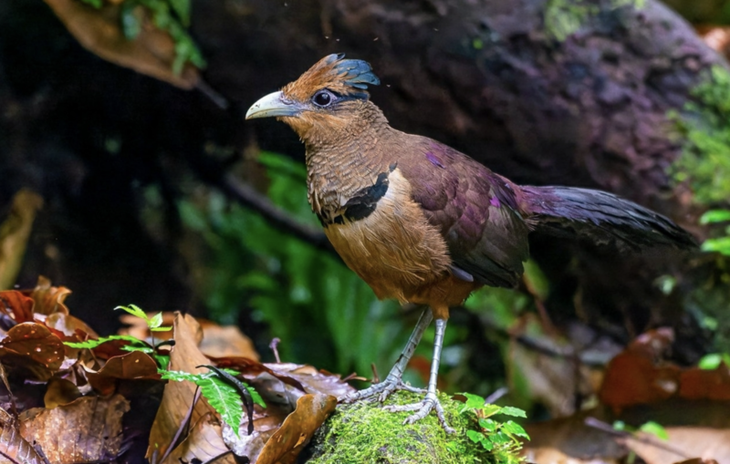

The _Neomorphus_ Ground-Cuckoos are rarely-seen birds that follow ant swarms in Amazonian forests.

  
   
  <i>Neomorphus geoffroyi</i> (Rufous-vented Ground-Cuckoo)

Neomorphus (`neo` on the command line) is also a framework for defining agentic AI workflows. It's
just an early experimental prototype: not ready for use. It has two key principles:

1. AI agents are intelligent and can carry out complex tasks. However, for non-trivial projects we
   will often want to enforce that the entire project is broken down into stages (a "workflow"),
   with each stage being done by an agent. We want to enforce that workflow ourselves, rather than
   describing it to an agent and hoping it follows it faithfully.

2. The human user will often want to participate in some of these stages of work, so that they
   acquire understanding of the design and implementation, rather than leaving it all to human
   review stages.

The basic idea of working with `neo` is:

- You specify a workflow defining how an AI agent will collaborate with you to do task definition,
  planning, implementation, review, etc.

- The file system is the point of truth. At any point (any git commit) `neo` can determine what
  stage you're at by the presence/absence of certain special files (task definition, plans, etc).

- `neo` knows the available next actions given the current task state. It can generate a prompt for
  an agent to carry them out, and it can have the agent do it, in collaboration with you, or
  automatically.